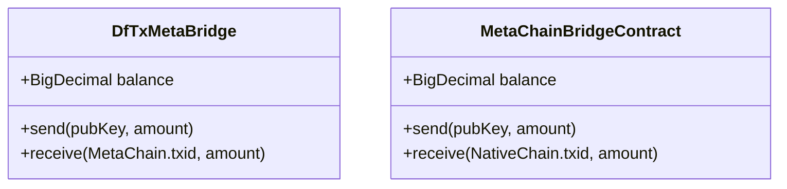
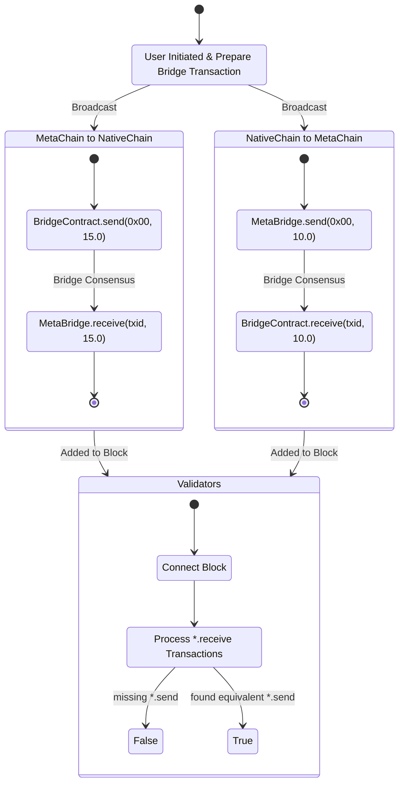

:::div{class="admonitions yellow"}
Currently work in progress — this article/page is consider draft, the information reflected here might not be
up-to-date.
:::

A blockchain bridge, also known as a network bridge, allows assets to be moved between different Blockchains. Bridges
facilitate information transfer between separate networks, enabling assets to be moved between blockchain
ecosystems. Generally, there are 2 types of bridges, Trusted Bridges and Trustless Bridges.

## Types of bridge

> To better understand MetaChain Tokens & Bridge design, you will first need to understand the different types of
> bridges deployed today. See [ethereum.org/bridges/#types-of-bridge](https://ethereum.org/en/bridges/#types-of-bridge).

| **Trusted Bridges**                                                                                                                                     | **Trustless Bridges**                                                                            |
| ------------------------------------------------------------------------------------------------------------------------------------------------------- | ------------------------------------------------------------------------------------------------ |
| Trusted bridges depend upon a central entity or system for their operations.                                                                            | Trustless bridges operate using smart contracts and algorithms.                                  |
| They have trust assumptions with respect to the custody of funds and the security of the bridge. Users mostly rely on the bridge operator's reputation. | They are trustless; the security of the bridge is the same as that of the underlying blockchain. |
| Users need to give up control of their crypto assets.                                                                                                   | Through smart contracts, trustless bridges enable users to remain in control of their funds.     |

In a nutshell, we can say that trusted bridges have trust assumptions, whereas trustless bridges are trust-minimized and
don’t make new trust assumptions beyond those of the underlying domains. Here’s how these terms can be described:

- **Trustless**: having equivalent security to the underlying domains.
- **Trust assumptions**: moving away from the security of the underlying domains by adding external verifiers in the
  system, thus making it less crypto-economically secure.

## MetaChain Trustless Bridge

DeFiChain Native<->Meta Bridge is a trustless bidirectional asset bridging between NativeChain (UTXO) and MetaChain
(Account). MetaChain Bridge has the equivalent security of a trustless bridge without the security worries of the underlying
domains. MetaChain and NativeChain operate under the same domain, and the same [consensus](/consensus) mechanism within
the same ecosystem keeps the validators honest.

DeFiChain introduces a set of Smart Contracts on each platform/chain to perform the bidirectional minting and burning.
The supply of all DFI comes from the NativeChain; all DFI on MetaChain are bridged from the NativeChain.

### Trustless Bridge Smart Contract

**NativeChain Asset Bridge Native Contract**

- `DfTx.MetaChain.send(pubKey, amount)`
- `DfTx.MetaBridge.receive(MetaChain.txid, amount)`

**MetaChain Asset Bridge EVM Contract**

- `MetaChain.BridgeContract.send(pubKey, amount)`
- `MetaChain.BridgeContract.receive(NativeChain.txid, amount)`

### Validating & Finalizing

MetaChain trustless bridge actions are atomic and finalized within a single block. Each `send` requires an
equivalent `receive` on the other chain within the same block. When a `txid = DfTx.MetaBridge.send(pubKey, 1.0)`
transaction is present on the NativeChain, an equivalent `MetaChain.BridgeContract.receive(txid, 1.0)` must be present
on the MetaChain.

All `*.receive` transactions will be automatically created by the DeFiChain consensus and included in the coinbase
transaction for block import. Validators connecting blocks with the bridge transactions validate the legitimacy of each
block by validating that each `*.receive` has an equivalent `*.send` transaction.

