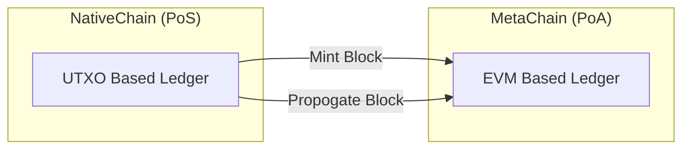

:::div{class="admonitions yellow"}
Currently work in progress — this article/page is consider draft, the information reflected here might not be
up-to-date.
:::

## Proof-of-?

'Proof-Of-x' is often colloquially referred to as the consensus mechanism generally agreed upon between multiple actors for
moving the chain forward. Given there is no disagreement between multiple actors, a consensus is achieved. Since its
genesis, DeFiChain has used a Proof-Of-Stake (PoS) consensus mechanism adapted from Bitcoin Core's original
Proof-Of-Work (PoW) implementation for moving the chain forward.

For the purpose of describing the different DeFiChain consensus at play, NativeChain refers to the UTXO Bitcoin-based
chain, while MetaChain refers to the EVM-based chain.

### Proof-Of-Stake (PoS) at NativeChain

NativeChain utilizes a Proof-of-Stake (PoS) algorithm similar to Bitcoin Core's original Proof-of-Work (PoW) mining
algorithm. Validators are selected in proportion to their quantity of holdings in the associated cryptocurrency.

NativeChain uses the concept of Masternode for its PoS implementation. To run a Masternode on NativeChain, a staker must
hold a minimum of 20,000 DFI. Masternodes on NativeChain participate in active transaction validations and block
creations. Each staking node can perform only 1 hash per second, with the nonce from the Bitcoin Core PoW algorithm
replaced by a staker's masternode ID.

### Proof-Of-Authority (PoA) at MetaChain

The Proof-Of-Authority (PoA) is a consensus method that gives a designated number of actors the power to validate
transactions within the network. MetaChain validators are Masternodes appointed from the NativeChain group of
validators. Running a Masternode on NativeChain allows the actor to validate transactions on the MetaChain network as
they do on the NativeChain network.

## MetaChain Consensus-lite Design

Operating on a consensus-lite design via Proof-Of-Authority (PoA), the MetaChain embeds each EVM Block on the
NativeChain. It relies on NativeChain peer-to-peer networking for block propagation. Connectivity between NativeChain
and MetaChain is established through JSON-RPC, secured within a trusted communication medium.

### Block Creation

When the NativeChain validator finds a valid hash, it will instruct the attached MetaChain node to mint a new block. The
attached MetaChain node will mint a new block encoded
with [SCALE CODEC](https://docs.substrate.io/reference/scale-codec/). The newly minted block will be next on top of the
current tip, embedded into the NativeChain block index and propagated via NativeChain peer-to-peer networking.

### Block Connecting

MetaChain has no peer-to-peer (p2p) networking capability; encoded blocks are imported and propagated via the
NativeChain p2p network. The encoded blocks are imported into MetaChain during NativeChain `connectBlock()`. MetaChain
does its block validation separately and in addition to NativeChain's validation. Once validated and indexed on
MetaChain, NativeChain will deem the entire block as valid during the `connectBlock()` subroutine.

### Benefits of a consensus-lite Design

Utilizing a consensus-lite design removes the usual complexity and problems that arise from a consensus-heavy design.
Piggybacking on NativeChain, we isolate and concentrate consensus design decisions into the NativeChain. Rollback and
fork resolutions become a non-issue on MetaChain as the NativeChain handles it.

> ### Precedent for Innovation
>
> To set the precedent for innovation, MetaChain consensus is designed to be consensus-lite for continuous and
> sustainable iterative development. MetaChain is designed to be operated as a parallel subnet of the NativeChain; it
> utilizes the NativeChain consensus mechanism to move the chain forward, allowing more subchains to be abstracted and
> added.
