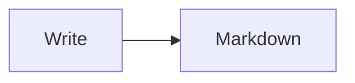

Powered by [BirthdayResearch/contented](https://contented.dev), `contented.js` allows prose/markdown to be developed
within its contextual repository as micro-docs. Separating content generation from content presentation. Downstream
(e.g. defichain.com) can pull structured prose and represent them however they like.  
**Commit your documentation into the repository together with your code.**

> Why micro-docs? Think of a modern web-app, it is commonly agreed among developers in this decade that organizing files
> by file type (html/js/css) don't scale well for software development. Code related to a single feature should share a
> singular context, we shouldn't force it to be split between 3 files or folders for the false impression of "separation
> of concerns". Same goes for prose/markdown.

---

## Installing

Optional! You can treat it like you are committing plain old markdown files. CI/CD are added into this repository, you
can let the CI/CD compile and generate the preview for you.

```shell
cd ./docs
# Install
npm ci
# Preview Website on localhost:3000
npm run write
```

## Structuring your Markdown

```
docs/
├─ 01:Sections/
│  ├─ 01:Sub Sections 1/*.md
│  ├─ 02:Sub Sections 2/*.md
│  ├─ 90:overview.md
│  └─ 99:faq.md
├─ .gitignore
├─ contented.js
├─ package.json
└─ package-lock.json
```

Files are ordered alphabetically, contented allows you to prefix your markdown file or directory with a number
prefix (`[0-9]+:(.+).md`, e.g. `01:file.md`). With the number prefix set, you can control how your content are sorted.

## Supported Features

[contented.dev/markdown](https://contented.dev/markdown)

### Frontmatter

```markdown
---
title: Title of Markdown
---
```

Configurable and type-checked in `contented.js`.

### Admonitions

```markdown
:::div{class="admonitions"}
Markdown goes here.
:::
```

::::div{class="admonitions"}
Markdown goes here.
::::

- `:::div{class="admonitions"}`
- `:::div{class="admonitions red"}`
- `:::div{class="admonitions yellow"}`
- `:::div{class="admonitions green"}`

### Mermaid

````markdown

````


